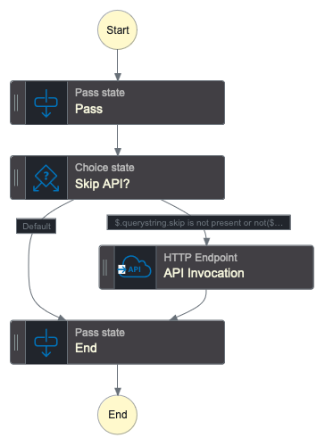
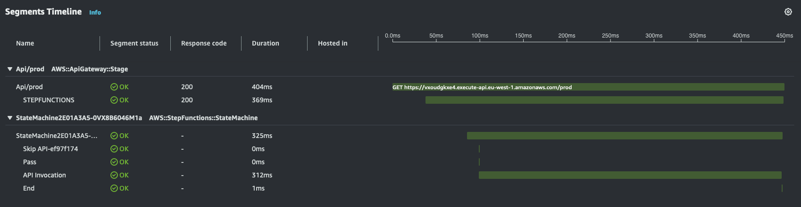
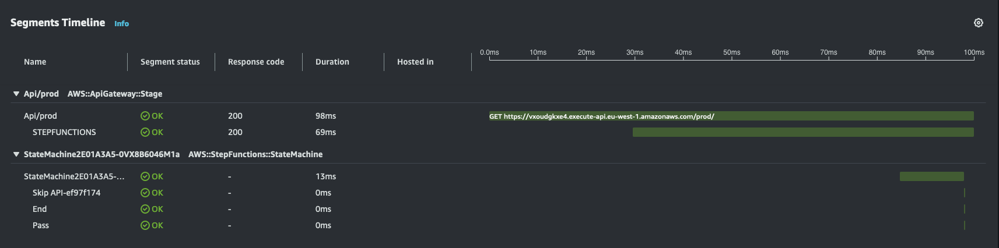

# Step Function Express API Example

This is a simple Step Function (EXPRESS) implementation of an AWS API Gateway REST API.
It uses CDK to construct a sample state machine that is invoked by an API Gateway Proxy Integration.

## Step Function Design

The state machine invokes an HTTPS endpoint using an [HTTP Task](https://docs.aws.amazon.com/step-functions/latest/dg/connect-third-party-apis.html) defined by an EventBridge HTTP Connection.
A choice state allows the HTTP invocation to be skipped if the `skip=true` query string is provided in the URL.



## Deployment

```sh
npm install
cdk deploy
```
The API Gateway HTTPS endpoint is printed to the screen on successful deployment.

## Evaluating

X-Ray tracing is enabled for the API deployment and the Step Function, allowing you to see errors and performance metrics.

Execute the API as follows (using cURL):

```sh
curl -v https://<REPLACE_WITH_YOURAPI_ID>.execute-api.eu-west-1.amazonaws.com/prod
```

To skip the API invocation and run the simple `Pass` and `Choice` states of the step function, add the `skip=true` query parameter:

```sh
curl -v "https://<REPLACE_WITH_YOURAPI_ID>.execute-api.eu-west-1.amazonaws.com/prod?skip=true"
```

With the HTTP invocation step, this sample shows 404ms end-to-end with 369ms of that for the HTTP invocation.


Skipping the HTTP invocation step, the following sample shows 98ms end-to-end, with 13ms for the State Machine execution. The rest of the time appears to be in the Step Function service orchestration.


## Cleaning up
```sh
cdk destroy
```